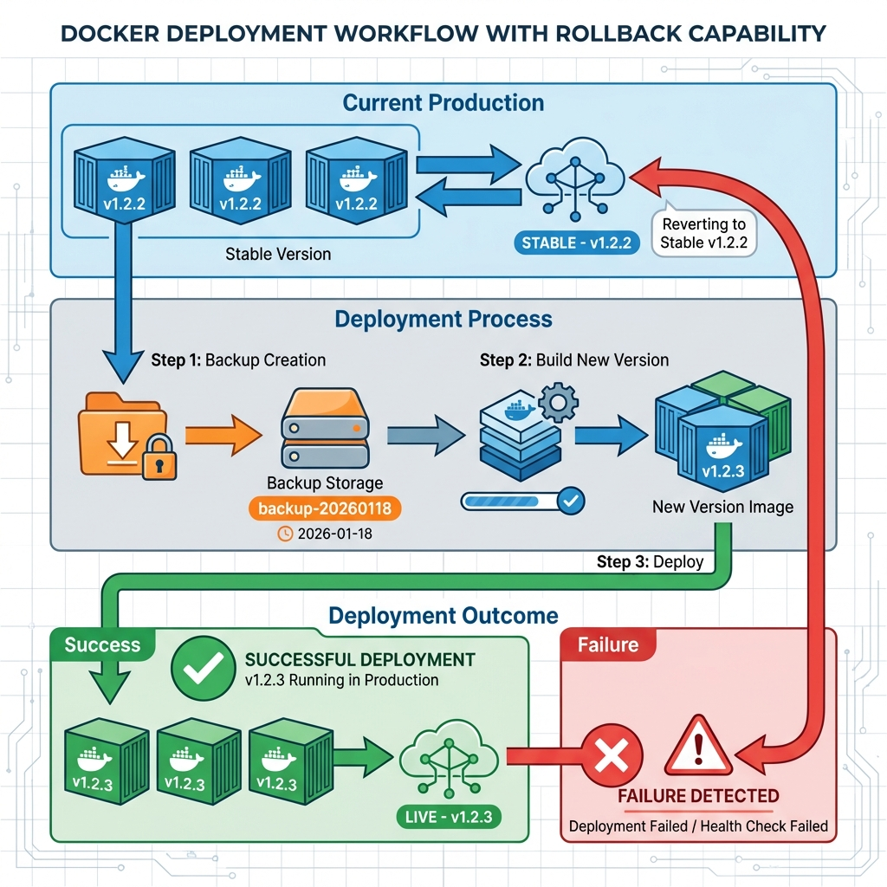

# Deployment Guide

Complete guide for deploying the AI Code Generation Platform with rollback support.

**Table of Contents:**
- [Quick Deployment (Development)](#quick-deployment-development)
- [Production Deployment Strategy](#production-deployment-strategy)
- [Automated Deployment Scripts](#automated-deployment-scripts)
- [Manual Deployment Workflow](#manual-deployment-workflow)
- [Rollback Procedures](#rollback-procedures)
- [Ubuntu Server Setup](#ubuntu-server-setup)
- [Manual Commands Reference](#manual-commands-reference)
- [Best Practices](#best-practices)

---

## Quick Deployment (Development)

For quick development deployments without version control:

### 1. Cleanup Old Containers
Remove any containers that might be lingering from previous deployments with inconsistent names.

```bash
docker rm -f $(docker ps -aq --filter "name=Lee-ai-code-platform")
```

### 2. Deploy with Auto-Update
Build and start the containers. This uses the `backend/.env` file and forces the project name to `aicode` to prevent future conflicts.

```bash
docker-compose --env-file backend/.env -p aicode up -d --build
```

---

## Production Deployment Strategy

### Overview

We use **versioned Docker images** with a systematic tagging approach that preserves previous versions for quick rollbacks.

### Deployment Workflow Diagram



The diagram above illustrates our deployment process:
1. **Current Production** runs a stable version (e.g., v1.2.2)
2. **Deployment Process** creates backups, builds new images, and deploys
3. **Deployment Outcome** either succeeds (v1.2.3 goes live) or fails (automatic rollback to v1.2.2)

### Version Tagging Convention

- **Production versions**: `v1.0.0`, `v1.1.0`, `v2.0.0` (semantic versioning)
- **Latest stable**: `latest` tag (always points to current production)
- **Backup tags**: `backup-YYYYMMDD-HHMMSS` (timestamped backups)

### Advantages Over `docker-compose up --build`

| Feature | Before (--build) | After (Versioned Images) |
|---------|------------------|--------------------------|
| **Rollback Time** | 5-10 minutes (rebuild) | **10-30 seconds** |
| **Version History** | None | ✅ Complete history |
| **Safety** | Risky | ✅ Auto-rollback on failure |
| **Testing** | Deploy to test | ✅ Test before deploy |

---

## Automated Deployment Scripts

**Recommended for production deployments.**

### Deploy New Version

**Windows (PowerShell):**
```powershell
# Deploy version v1.2.3 with automatic backup
.\scripts\deploy.ps1 -Version "v1.2.3"

# Deploy without building (use existing images)
.\scripts\deploy.ps1 -Version "v1.2.3" -SkipBuild

# Deploy without creating backup (not recommended)
.\scripts\deploy.ps1 -Version "v1.2.3" -SkipBackup
```

**Linux/Ubuntu (Bash):**
```bash
# Make script executable (first time only)
chmod +x scripts/deploy.sh

# Deploy version v1.2.3 with automatic backup
./scripts/deploy.sh -v v1.2.3

# Deploy without building (use existing images)
./scripts/deploy.sh -v v1.2.3 --skip-build

# Deploy without creating backup (not recommended)
./scripts/deploy.sh -v v1.2.3 --skip-backup
```

**What the script does:**
- ✅ Automatically backs up current version
- ✅ Builds new Docker images with version tags
- ✅ Deploys new version
- ✅ Verifies deployment success
- ✅ Auto-rollback on failure

### Rollback to Previous Version

**Windows (PowerShell):**
```powershell
# Interactive rollback (shows available versions)
.\scripts\rollback.ps1

# Rollback to specific backup
.\scripts\rollback.ps1 -BackupTag "backup-20260118-095200"

# Rollback to specific version
.\scripts\rollback.ps1 -Version "v1.2.2"
```

**Linux/Ubuntu (Bash):**
```bash
# Make script executable (first time only)
chmod +x scripts/rollback.sh

# Interactive rollback (shows available versions)
./scripts/rollback.sh

# Rollback to specific backup
./scripts/rollback.sh -b backup-20260118-095200

# Rollback to specific version
./scripts/rollback.sh -v v1.2.2
```

---

## Manual Deployment Workflow

If you prefer manual control or need to understand the process:

### Step 1: Tag Current Production as Backup

Before deploying a new version, always tag the current production images:

**PowerShell:**
```powershell
# Get current timestamp
$timestamp = Get-Date -Format "yyyyMMdd-HHmmss"

# Tag current images as backup
docker tag lee-ai-code-platform-backend:latest lee-ai-code-platform-backend:backup-$timestamp
docker tag lee-ai-code-platform-frontend:latest lee-ai-code-platform-frontend:backup-$timestamp

# List backups to verify
docker images | Select-String "lee-ai-code-platform"
```

**Bash:**
```bash
# Get current timestamp
timestamp=$(date +%Y%m%d-%H%M%S)

# Tag current images as backup
docker tag lee-ai-code-platform-backend:latest lee-ai-code-platform-backend:backup-$timestamp
docker tag lee-ai-code-platform-frontend:latest lee-ai-code-platform-frontend:backup-$timestamp

# List backups to verify
docker images | grep lee-ai-code-platform
```

### Step 2: Build New Version

Build new images with version tags:

**PowerShell:**
```powershell
# Set your version number
$version = "v1.2.3"

# Build with version tag
docker build -t lee-ai-code-platform-backend:$version -t lee-ai-code-platform-backend:latest ./backend
docker build -t lee-ai-code-platform-frontend:$version -t lee-ai-code-platform-frontend:latest ./frontend
```

**Bash:**
```bash
# Set your version number
version="v1.2.3"

# Build with version tag
docker build -t lee-ai-code-platform-backend:$version -t lee-ai-code-platform-backend:latest ./backend
docker build -t lee-ai-code-platform-frontend:$version -t lee-ai-code-platform-frontend:latest ./frontend
```

### Step 3: Deploy New Version

```bash
# Stop current containers
docker-compose -p aicode down

# Start with new images
docker-compose --env-file backend/.env -p aicode up -d

# Verify deployment
docker-compose -p aicode ps
docker logs Lee-ai-code-platform-backend --tail 50
docker logs Lee-ai-code-platform-frontend --tail 50
```

### Step 4: Test New Deployment

```bash
# Check backend health
curl http://localhost:4531/health

# Check frontend
curl http://localhost:4530

# Monitor logs for errors
docker-compose -p aicode logs -f
```

---

## Rollback Procedures

### Quick Rollback (Using Backup Tags)

**PowerShell:**
```powershell
# Find your backup version
docker images | Select-String "backup"

# Set the backup timestamp you want to restore
$backup_timestamp = "20260118-095200"

# Re-tag backup as latest
docker tag lee-ai-code-platform-backend:backup-$backup_timestamp lee-ai-code-platform-backend:latest
docker tag lee-ai-code-platform-frontend:backup-$backup_timestamp lee-ai-code-platform-frontend:latest

# Restart containers with rollback images
docker-compose -p aicode down
docker-compose --env-file backend/.env -p aicode up -d

# Verify rollback
docker-compose -p aicode ps
```

**Bash:**
```bash
# Find your backup version
docker images | grep backup

# Set the backup timestamp you want to restore
backup_timestamp="20260118-095200"

# Re-tag backup as latest
docker tag lee-ai-code-platform-backend:backup-$backup_timestamp lee-ai-code-platform-backend:latest
docker tag lee-ai-code-platform-frontend:backup-$backup_timestamp lee-ai-code-platform-frontend:latest

# Restart containers with rollback images
docker-compose -p aicode down
docker-compose --env-file backend/.env -p aicode up -d

# Verify rollback
docker-compose -p aicode ps
```

### Rollback to Specific Version

**PowerShell:**
```powershell
# If you know the version number
$version = "v1.2.2"

# Re-tag as latest
docker tag lee-ai-code-platform-backend:$version lee-ai-code-platform-backend:latest
docker tag lee-ai-code-platform-frontend:$version lee-ai-code-platform-frontend:latest

# Restart containers
docker-compose -p aicode down
docker-compose --env-file backend/.env -p aicode up -d
```

**Bash:**
```bash
# If you know the version number
version="v1.2.2"

# Re-tag as latest
docker tag lee-ai-code-platform-backend:$version lee-ai-code-platform-backend:latest
docker tag lee-ai-code-platform-frontend:$version lee-ai-code-platform-frontend:latest

# Restart containers
docker-compose -p aicode down
docker-compose --env-file backend/.env -p aicode up -d
```

### Emergency Rollback Checklist

- [ ] Identify the issue and decide rollback is necessary
- [ ] Find the last known good version/backup tag
- [ ] Re-tag the good version as `latest`
- [ ] Stop current containers: `docker-compose -p aicode down`
- [ ] Start with rollback version: `docker-compose -p aicode up -d`
- [ ] Verify services are running: `docker-compose -p aicode ps`
- [ ] Check logs for errors: `docker-compose -p aicode logs -f`
- [ ] Test critical functionality
- [ ] Document what went wrong for post-mortem

---

## Ubuntu Server Setup

### Prerequisites

Ensure you have the following installed on your Ubuntu server:

```bash
# Update package list
sudo apt update

# Install Docker (if not already installed)
curl -fsSL https://get.docker.com -o get-docker.sh
sudo sh get-docker.sh

# Install Docker Compose (if not already installed)
sudo apt install docker-compose -y

# Add your user to docker group (to run docker without sudo)
sudo usermod -aG docker $USER

# Log out and back in for group changes to take effect
```

### First-Time Setup

```bash
cd /path/to/ai-code-platform

# Make deployment scripts executable
chmod +x scripts/deploy.sh
chmod +x scripts/rollback.sh

# Verify permissions
ls -la scripts/*.sh
```

### Tag Your Current Version

If you already have running containers, tag them as your baseline:

```bash
# Tag current images as v1.0.0 (or your current version)
docker tag lee-ai-code-platform-backend:latest lee-ai-code-platform-backend:v1.0.0
docker tag lee-ai-code-platform-frontend:latest lee-ai-code-platform-frontend:v1.0.0

# Verify tags
docker images | grep lee-ai-code-platform
```

### Troubleshooting

**Permission Denied:**
```bash
# Make sure scripts are executable
chmod +x scripts/deploy.sh scripts/rollback.sh

# Or run with bash explicitly
bash scripts/deploy.sh -v v1.2.3
```

**Docker Permission Issues:**
```bash
# Add user to docker group
sudo usermod -aG docker $USER

# Log out and back in, or run:
newgrp docker

# Verify
docker ps
```

**Build Failures:**
```bash
# Check Docker is running
sudo systemctl status docker

# Check disk space
df -h

# Check Docker logs
sudo journalctl -u docker -n 50
```

### Database Migration

After deploying, run database migrations if the schema has changed:

```bash
# Run the migration script inside the backend container
docker exec -it Lee-ai-code-platform-backend python update_db_schema.py
```

This script will:
- Add missing columns (e.g., `is_robot`, `organization_id`)
- Create new tables for RBAC and organizations
- Seed initial roles and permissions
- Set up database indexes and triggers

**Note:** The migration script is idempotent - safe to run multiple times.

---

## Manual Commands Reference

### View Running Containers

```bash
docker-compose -p aicode ps
```

### View Logs

```bash
# All services
docker-compose -p aicode logs -f

# Specific service
docker logs Lee-ai-code-platform-backend -f
docker logs Lee-ai-code-platform-frontend -f
```

### Stop Services

```bash
docker-compose -p aicode down
```

### Restart Services

```bash
docker-compose -p aicode restart
```

### Image Management

**List All Images:**
```bash
# Backend images
docker images lee-ai-code-platform-backend

# Frontend images
docker images lee-ai-code-platform-frontend
```

**Remove Old Images:**
```bash
# Remove dangling images
docker image prune

# Remove all unused images
docker image prune -a

# Remove images older than 30 days (keep recent backups)
docker image prune -a --filter "until=720h"

# Or manually remove specific versions
docker rmi lee-ai-code-platform-backend:v1.0.0
```

**Save Images to Archive (Offline Backup):**

PowerShell:
```powershell
# Create backup directory
New-Item -ItemType Directory -Force -Path ./docker-backups

# Save current version to tar file
$date = Get-Date -Format "yyyyMMdd"
docker save lee-ai-code-platform-backend:latest | gzip > "./docker-backups/backend-$date.tar.gz"
docker save lee-ai-code-platform-frontend:latest | gzip > "./docker-backups/frontend-$date.tar.gz"

# Restore from archive if needed
docker load -i "./docker-backups/backend-$date.tar.gz"
```

Bash:
```bash
# Create backup directory
mkdir -p ./docker-backups

# Save current version to tar file
date=$(date +%Y%m%d)
docker save lee-ai-code-platform-backend:latest | gzip > "./docker-backups/backend-$date.tar.gz"
docker save lee-ai-code-platform-frontend:latest | gzip > "./docker-backups/frontend-$date.tar.gz"

# Restore from archive if needed
docker load -i "./docker-backups/backend-$date.tar.gz"
```

### Health Checks

**Check Backend Health:**
```bash
curl http://localhost:4531/health
```

**Check Frontend:**
```bash
curl http://localhost:4530
```

---

## Best Practices

1. **Always tag before deploying**: Never deploy without creating a backup tag
2. **Use semantic versioning**: Follow `vMAJOR.MINOR.PATCH` format
3. **Test in staging first**: If possible, test new versions in a staging environment
4. **Monitor after deployment**: Watch logs for at least 5-10 minutes after deployment
5. **Document changes**: Keep a changelog of what changed in each version
6. **Keep recent backups**: Maintain at least 3-5 recent backup versions
7. **Database migrations**: If you have database changes, backup the database before deploying
8. **Use automated scripts**: Prefer `deploy.sh`/`deploy.ps1` over manual commands for consistency
9. **Regular cleanup**: Remove old Docker images periodically to save disk space
10. **Security**: Keep Docker updated and limit access to docker socket

---

## Using docker-compose with Version Tags

### Option 1: Modify docker-compose.yml for Production

For production deployments, modify `docker-compose.yml` to use `image:` instead of `build:`:

```yaml
services:
  backend:
    image: lee-ai-code-platform-backend:latest
    # build: ./backend  # Comment out in production
    container_name: Lee-ai-code-platform-backend
    # ... rest of config

  frontend:
    image: lee-ai-code-platform-frontend:latest
    # build: ./frontend  # Comment out in production
    # ... rest of config
```

### Option 2: Create Separate Compose Files

We've provided `docker-compose.prod.yml` for production use:

```bash
# Development (with builds)
docker-compose -f docker-compose.yml up -d --build

# Production (with versioned images)
VERSION=v1.2.3 docker-compose -f docker-compose.prod.yml up -d
```

---

## See Also

- **[QUICK_REFERENCE.md](./QUICK_REFERENCE.md)** - One-page cheat sheet for common operations
- **[scripts/README.md](../scripts/README.md)** - Detailed script documentation
- **[docker-compose.prod.yml](../docker-compose.prod.yml)** - Production compose file example
