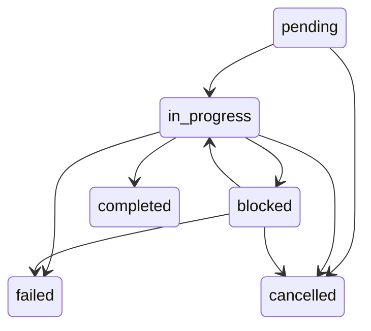
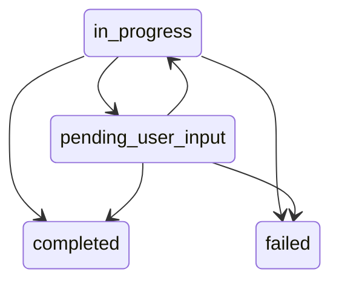

# Task

## Task's status
- **pending** PENDING
- **in_progress** IN_PROGRESS
- **blocked** BLOCKED
- **completed** COMPLETED
- **failed** FAILED
- **cancelled** CANCELLED

## Task workflow
| Matrix                   | pending| in_progress| blocked| completed| failed| cancelled|
|:-------------------------|:------:|:----------:|:------:|:--------:|:-----:|:--------:|
| pending                  |        | ✅         |       |          |       | ✅      |
| in_progress              |       |            | ✅    | ✅       | ✅    | ✅      |
| blocked                  |       | ✅         |       |          | ✅    | ✅      |
| completed                |       |            |       |           |       |          |
| failed                   |       |            |       |           |       |         |
| cancelled                |       |            |       |          |       |         |

### Task Workflow Diagram

## Task's Stage
- **requirement** REQUIREMENT 
- **spec_generation** SPEC_GENERATION 
- **spec_review** SPEC_REVIEW 
- **code_generation** CODE_GENERATION 
- **pr_created** PR_CREATED 
- **code_review** CODE_REVIEW 
- **ci_running** CI_RUNNING 
- **cd_staging** CD_STAGING 
- **approval_pending** APPROVAL_PENDING 
- **cd_production** CD_PRODUCTION 
- **deployed** DEPLOYED 
- **failed** FAILED 

# Activity

## Activity's status
- **in_progress** IN_PROGRESS 
- **pending_user_input** PENDING_USER_INPUT 
- **completed** COMPLETED 
- **failed** FAILED 

## Activity workflow
| Matrix                   | in_progress | pending_user_input | completed | failed |
|:-------------------------|:----------:|:-------------------:|:---------:|:------:|
| in_progress              |            | ✅                 | ✅        | ✅     |
| pending_user_input       | ✅         |                    | ✅        | ✅     |
| completed                |            |                    |           |         |
| failed                   |            |                    |           |         |

### Activity Workflow Diagram

## Activity's Task-role
- Specification preparing
- Manual Fixing 
- Agent Fixing 
- Manual Testing
- Unlimited ...

